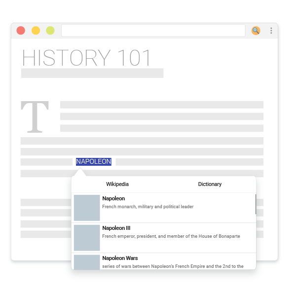
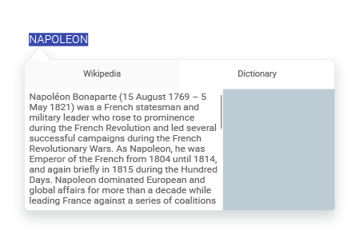
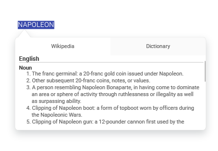

 

    
 

Welcome to my little project: Wikilinks 🖖

The main goal is to be a handy chrome extension to fast and efficiently search terms on Wikipedia.

## The idea
What I always try to do is to simplify the life of everyone and, consequently, do everything in an efficient way, so when I saw that beautiful popup in a Wikipedia's article, I told myself that the entire web had to have that... so here I am trying to do that.

If you don't know what I'm talking about, just hover the pointer over some words in [this article](https://en.wikipedia.org/wiki/Albert_Einstein) about Albert Einstein.

## How it works
When the user selects a text, it will make a quick call to Wikipedia API and return a list of results that will be shown in a popup below the selection.

    

 
After the user have selected an option, it will be displayed there, too. If he wants to see the wiktionary definitions, tha tab [Dictionary] can be clicked.

 

## Under the hood
## Todo List
- [x] Fix popup out screen boundary.
- [ ] Get better wikipedia responses.
- [ ] Implement shortcuts.
- [ ] Implement options page.
- [ ] Black List sites.